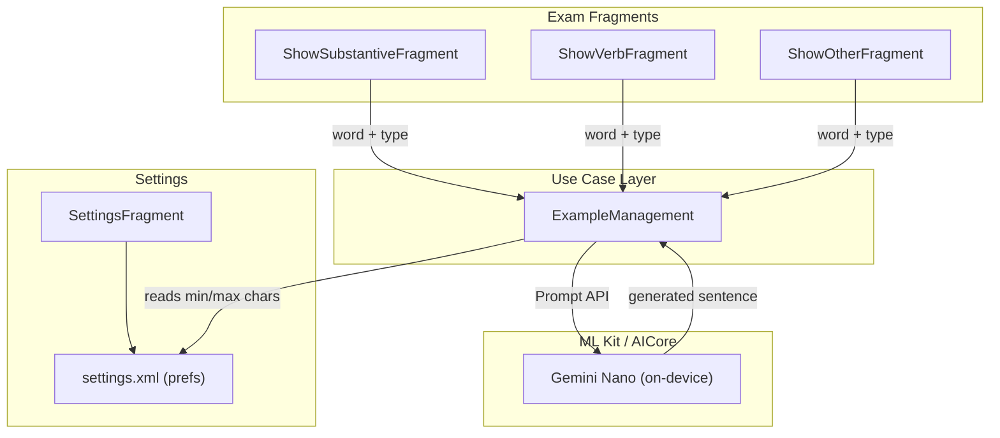

# MGV v6.0.0 — On-Device Example Sentence Feature

> **How to use this file:** In a future session, tell the AI agent:
> "Read `PLAN_v6.0.0.md` and implement it."

## Overview

Add an "Example" button to all three exam fragments (`ShowSubstantiveFragment`, `ShowVerbFragment`, `ShowOtherFragment`) that uses the ML Kit GenAI Prompt API (Gemini Nano on-device) to generate a contextual German example sentence for the currently displayed word. Sentence length limits are configurable in Settings.

## Architecture overview



## Key constraints from ML Kit Prompt API

- Dependency: `com.google.mlkit:genai-prompt:1.0.0-beta2`
- Requires API 26+. App `minSdk` is 30 — no extra guard needed.
- `Generation.getClient()` → `checkStatus()` → optionally `download()` → `generateContent(prompt)`
- `generateContent` is a **suspend function** — must run on a coroutine (use `lifecycleScope.launch`).
- `UNAVAILABLE` status means the device does not support Gemini Nano at all; must be handled gracefully.
- Output is purely on-device — stays offline, matching the app's no-network policy.
- `maxOutputTokens` optional param can cap response length; use it together with the prompt itself.

## Tasks (implement in order)

### 1. `app/build.gradle`
- Bump `versionCode` to 41, `versionName` to `"6.0.0"`.
- Add dependency: `implementation("com.google.mlkit:genai-prompt:1.0.0-beta2")`

### 2. New use-case: `use_cases/ExampleManagement.kt`
- Holds a single `GenerativeModel` instance obtained from `Generation.getClient()`.
- Exposes `suspend fun generateExample(word: String, wordType: String, minChars: Int, maxChars: Int): Result<String>`.
- Prompt template (English, Gemini Nano's validated language):
  > `"Write exactly one German sentence using the word \"<word>\" (<wordType>). The sentence must be between <min> and <max> characters long. Reply with only the sentence."`
- Returns `Result.failure` with a user-friendly message when status is `UNAVAILABLE` or an exception is thrown.
- `checkAndPrepare()` — called lazily on first button tap to check/download the model.

### 3. `app/src/main/res/xml/settings.xml`
Add two `EditTextPreference` entries after the existing ones:
```xml
<EditTextPreference
    android:key="preference_example_min_chars"
    android:title="@string/setting_example_min_chars"
    android:inputType="number"
    android:defaultValue="40"
    android:selectAllOnFocus="true"
    app:allowDividerAbove="true"
    app:useSimpleSummaryProvider="true" />

<EditTextPreference
    android:key="preference_example_max_chars"
    android:title="@string/setting_example_max_chars"
    android:inputType="number"
    android:defaultValue="150"
    android:selectAllOnFocus="true"
    app:allowDividerAbove="true"
    app:useSimpleSummaryProvider="true" />
```

### 4. `presentation/SettingsFragment.kt`
- Add validation for `preference_example_min_chars` and `preference_example_max_chars` (positive integer, min < max).
- Existing validation pattern: see `INF_NUM_CHAR_LIMIT`/`SUP_NUM_CHAR_LIMIT` companion object constants.

### 5. Layouts — add `button_example` to all three exam layouts

Files: `fragment_show_substantive.xml`, `fragment_show_verb.xml`, `fragment_show_other.xml`

- Current bottom button row: `[Show] [Next]` with `[Quit]` below.
- New row: `[Show] [Example] [Next]` with `[Quit]` below.
- `button_example` starts **invisible** (`android:visibility="invisible"`).
- It becomes **visible** only after `showMeaning()` is called.
- It returns to invisible on `showNextName()` / `showNextInfinitive()`.

### 6. Exam fragments — wire `button_example`

Same pattern in all three fragments (`ShowSubstantiveFragment.kt`, `ShowVerbFragment.kt`, `ShowOtherFragment.kt`):

```kotlin
// Lazy singleton shared across the three fragments via MGVApplication
val exampleManagement by lazy { (requireActivity().application as MGVApplication).exampleManagement }

// In onViewCreated:
binding.buttonExample.visibility = View.INVISIBLE

binding.buttonExample.setOnClickListener {
    binding.buttonExample.isEnabled = false
    lifecycleScope.launch {
        val prefs = PreferenceManager.getDefaultSharedPreferences(requireContext())
        val minChars = prefs.getString("preference_example_min_chars", "40")?.toIntOrNull() ?: 40
        val maxChars = prefs.getString("preference_example_max_chars", "150")?.toIntOrNull() ?: 150
        val word = currentWordString() // bare word without article/hint
        val result = exampleManagement.generateExample(word, wordType, minChars, maxChars)
        result.fold(
            onSuccess = { sentence ->
                AlertDialog.Builder(requireContext())
                    .setTitle(getString(R.string.example_dialog_title))
                    .setMessage(sentence)
                    .setPositiveButton(android.R.string.ok, null)
                    .show()
            },
            onFailure = {
                Toast.makeText(requireContext(), it.message, Toast.LENGTH_LONG).show()
            }
        )
        binding.buttonExample.isEnabled = true
    }
}

// In showMeaning():  binding.buttonExample.visibility = View.VISIBLE
// In showNextName(): binding.buttonExample.visibility = View.INVISIBLE
```

Word extraction per fragment:
- `ShowSubstantiveFragment`: `vocabularyManagement.removeSubstantivePlural(substantive.name)` (base noun, no article)
- `ShowVerbFragment`: `vocabularyManagement.removeVerbHint(verb.infinitive)`
- `ShowOtherFragment`: the `.adjective` / `.adverb` / `.conjunction` / `.preposition` / `.pronoun` field from the current `vocabulary`

### 7. `MGVApplication.kt`
Add `val exampleManagement: ExampleManagement by lazy { ExampleManagement() }` so the `GenerativeModel` is initialised once and shared.

### 8. Strings — all 3 locale files

Add to `values/strings.xml`, `values-de/strings.xml`, `values-es/strings.xml`:

| Key | EN | DE | ES |
|-----|----|----|----|
| `example` | Example | Beispiel | Ejemplo |
| `example_dialog_title` | Example sentence | Beispielsatz | Frase de ejemplo |
| `setting_example_min_chars` | Min. sentence length (characters) | Min. Satzlänge (Zeichen) | Long. mínima de frase (caracteres) |
| `setting_example_max_chars` | Max. sentence length (characters) | Max. Satzlänge (Zeichen) | Long. máxima de frase (caracteres) |
| `example_unavailable` | Example sentences not available on this device | Beispielsätze auf diesem Gerät nicht verfügbar | Frases de ejemplo no disponibles en este dispositivo |
| `example_downloading` | Downloading language model… | Sprachmodell wird heruntergeladen… | Descargando modelo de idioma… |

## What is NOT in v6.0.0 (deferred to next release)

The right-swipe "Example" in the Search result list is explicitly out of scope for this release and will be planned separately.

## Version bump

- `versionCode 41`, `versionName "6.0.0"` in `app/build.gradle`.
